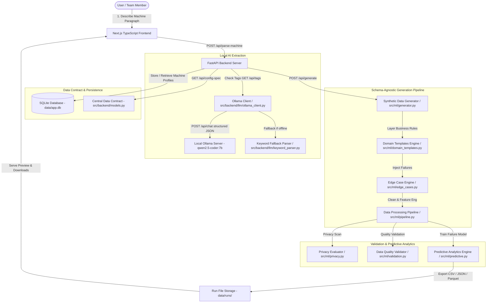

# System Architecture & Technical Specification

The **SynthEdge** platform is built as a schema-agnostic, privacy-preserving synthetic data and edge-case generation system powered by a local Ollama LLM (`qwen2.5-coder:7b`) for machine paragraph extraction and a high-performance Python ML engine for data synthesis.

---

## Mermaid Architecture Diagram

---

## Engine Modules Breakdown

1. **Central Data Contract (`src/backend/models.py`)**:
   Single source of truth Pydantic models for `MachineProfile`, `Parameter`, `GenerationConfig`, and single source endpoint `/api/config-spec`.

2. **Ollama Machine Parser (`src/backend/llm/ollama_client.py`)**:
   Queries local Ollama `/api/chat` with structured Pydantic JSON schema, strips `<think>` reasoning tags, retries once on parse errors, and falls back gracefully to `keyword_parser.py` if Ollama is stopped.

3. **Core Schema-Agnostic Data Generator (`src/ml/generator.py`)**:
   Vectorized NumPy/pandas data generator supporting all 5 parameter types (`number`, `category`, `boolean`, `text`, `datetime`), distributions (`uniform`, `normal`, `exponential`), chunked memory allocation up to 1M records, and exact seed reproducibility.

4. **Edge-Case Engine (`src/ml/edge_cases.py`)**:
   Schema-agnostic anomaly injector supporting 4 failure scenarios: *Boundary values*, *Missing or corrupted data*, *Combined equipment failure*, *Network outage*, with exact `round(records x frequency)` injection.

5. **Domain Templates Engine (`src/ml/domain_templates.py`)**:
   Layers statistical physics and business rules across 5 domains: *IoT / Manufacturing*, *Logistics*, *Finance*, *Healthcare*, *E-commerce*.

6. **Privacy Evaluator (`src/ml/privacy.py`)**:
   Evaluates exact matches, nearest-neighbor Euclidean distance matrix, k-anonymity group size, and regex PII scans (SSN, credit card, email, phone).

7. **Data Quality Validator (`src/ml/validation.py`)**:
   Evaluates schema compliance, completeness, range satisfaction, and Kolmogorov-Smirnov (KS) statistical goodness-of-fit.

8. **Predictive Analytics Engine (`src/ml/predictive.py`)**:
   Trains scikit-learn RandomForest classifiers WITH vs WITHOUT edge cases to quantify anomaly detection F1 and recall gains.
